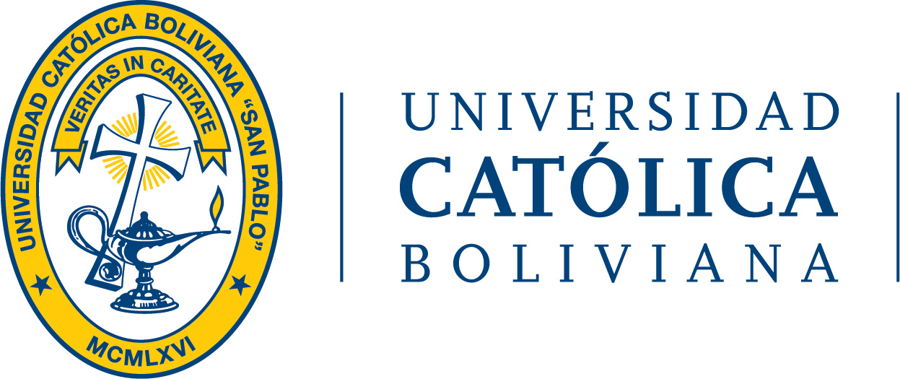

# Micro Quadruped Robot Prototype

This project aims to construct an educational and low-cost micro quadruped robot. The implementation involves concepts such as forward kinematics, inverse kinematics, Jacobians, force calculation, and motor sizing. These concepts are crucial for achieving a robot that reproduces precise, coordinated, and adaptable movements while ensuring efficiency and stability in various situations. The robot utilizes an ESP32 microprocessor to control its actions, with three mini servos attached to each leg to mimic quadrupedal animal movements.

 
---

## Keywords
Mechanical Design, Quadruped Robot, Forward Kinematics, Inverse Kinematics, MATLAB, Simulation.

## Objectives

### General Objective
Design and build an educational and low-cost micro quadruped robot prototype for practical learning in robotics.

### Specific Objectives
1. Detailed design of the micro robot structure considering functionality and economic viability.
2. Precise dimensioning of the quadruped robot, covering mechanical and electronic aspects.
3. Development and implementation of forward and inverse kinematics equations for precise motion control.
4. Determination of the analytical Jacobian of the system for performance analysis and optimization.
5. Calculation of torque for efficient operation, ensuring precise task execution.

---

## Simulation and Kinematics
The project includes simulations for forward and inverse kinematics, as well as workspace visualization.

 

---

## Hardware Design
The robot's hardware design includes an ESP32 microcontroller and servo motors for precise movement at low price.

 

---

## Authors
- [Leonardo Acha Boiano](https://github.com/leonardoAB1)
- [Bruno Ramiro Rejas](https://github.com/BrunoRRM712)
- [Gonzalo Peralta]()
- [Andrés Ayala](https://github.com/mecatrono)

### Supervisor
- [José Jesús Cabrera Pantoja](https://github.com/cpjosejesus)

---
